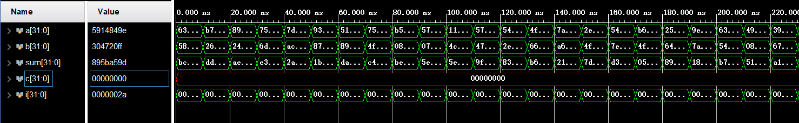

# 实验一：超前进位加法器

### 实验内容

使用Verilog实现了$32$位超前进位加法器。

### 文件内容

+ ./实验报告.pdf：该实验的实验报告。
+ ./code文件夹：储存实验相关代码的文件夹。
  + ./code/codemaker.cpp：用于生成32位超前进位加法器的代码的文件
  + ./code/adder.v：32位超前进位加法器的代码。
+ ./adder文件夹：Vavido中关于加法器的项目文件。

### 实验步骤

+ 设输入为$a$和$b$，输出为$sum$，其中三者均为$32$位整数。

+ 根据超前进位加法器的原理，写出$sum$中每一位的表达式：

  $$\begin{aligned}
  sum[0] &= (a[0] \oplus b[0]) \oplus c0 \\
  sum[1] &= (a[1] \oplus b[1]) \oplus (((a[0]~\&~b[0]))~|~((a[0] \oplus b[0])~\&~c0)) \\
  \dots &= \dots
  \end{aligned}$$

  其中，“$\oplus$”表示异或操作，“$\&$”表示与操作，“$|$”表示或操作。$c0$为当前的进位，此处取$c0=0$。
  
+ 使用C++语言，根据规律生成计算$sum$的每一位的代码。

+ 将生成的代码整合到adder.v中。

### 实验结果

$a[31:0]$表示第一个加数，$b[31:0]$表示第二个加数，$sum[31:0]$表示超前进位加法器得到的结果，$c[31:0]$表示的是标准答案与加法器得到的结果（$sum[31:0]$）之间的差值。可以发现，该$32$位超前进位加法器是正确的。
