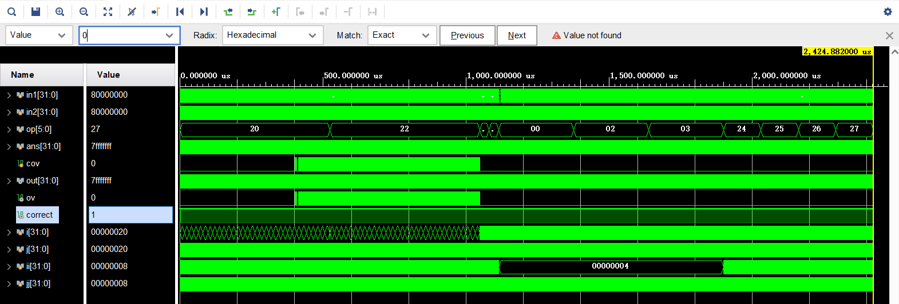
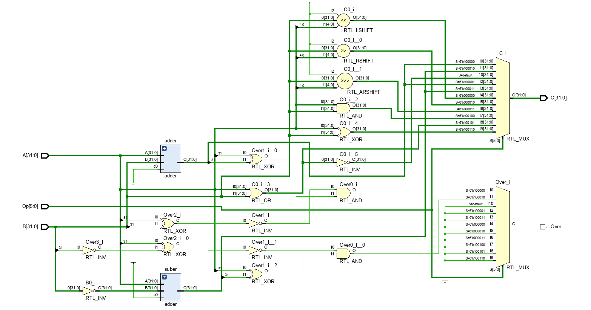

# 实验二：32位ALU

### 实验内容

使用Verilog设计实现$32$位ALU。

### 文件内容

+ ./实验报告.pdf：该实验的实验报告。
+ ./code文件夹：储存实验相关代码的文件夹。
  + ./code/alu.v：$32$位ALU的实现代码。
+ ./alu文件夹：Vivado中关于加法器的项目文件。

### 实验步骤

+ 将上次的$32$位超前进位加法器设置为一个模块，并调整其接口如下所示：

  ```verilog
  module adder(
      input [31:0] A,
      input [31:0] B,
      input c0,
      output [31:0] C
      );
  ```

  计算结果为$C=A+B+c0$，以便于处理负数的情况。

+ 先计算出$A+B$和$A-B$的结果，储存在两个临时变量中：

  ```verilog
  adder adder(A,  B, 0, tmpC_add);
  adder suber(A, ~B, 1, tmpC_sub);
  ```

+ 使用always和case相互配合实现多种功能。

  + ADD

    该运算的结果为之前计算得到的$tmpC\_add$。当且仅当$A$和$B$符号位相同，且$A$和计算结果（$C$）的符号位不同时，该计算发生了溢出，需要将$Over$设置为$1$。

  + ADDU

    计算结果为$tmpC\_add$。根据要求，$Over$恒为$0$。

  + SUB

    该运算的结果为之前计算得到的$tmpC\_sub$。当且仅当$A$和$B$符号位不同，且$A$和计算结果（$C$）的符号位不同时，该计算发生了溢出，需要将$Over$设置为$1$。

  + SUBU

    计算结果为$tmpC\_sub$。根据要求，$Over$恒为$0$。

  + SLL

    取出$A$的最低$5$位，然后将$B$左移后的结果储存到$C$中。根据要求，$Over$恒为$0$。

  + SRL

    取出$A$的最低$5$位，然后将$B$逻辑右移后的结果储存到$C$中。根据要求，$Over$恒为$0$。

  + SRA

    取出$A$的最低$5$位，然后将$B$算术右移后的结果储存到$C$中。根据要求，$Over$恒为$0$。

  + AND

    将$A$和$B$进行按位与之后的结果储存到$C$中。根据要求，$Over$恒为$0$。

  + OR

    将$A$和$B$进行按位或之后的结果储存到$C$中。根据要求，$Over$恒为$0$。

  + XOR

    将$A$和$B$进行按位异或之后的结果储存到$C$中。根据要求，$Over$恒为$0$。

  + NOR

    先将$A$和$B$进行按位或，然后在对结果取反，储存到$C$中。根据要求，$Over$恒为$0$。

### 实验结果



根据仿真结果，可以发现$correct$变量的值恒为$1$，所以该代码是正确的。



根据Vivado生成的电路图可以发现，电路中不存在锁存器（LATCH）。
