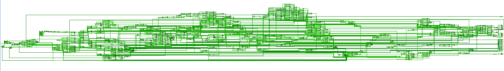

# 实验七：50条指令流水线CPU设计

### 实验内容

使用Verilog设计实现50条指令流水线CPU。

### 文件内容

+ ./实验报告.pdf：该实验的实验报告。
+ ./code文件夹：储存实验相关代码的文件夹。
  + ./code/TopLevel.sv：流水线CPU。
  + ./code/alu.v：算术/逻辑运算模块。
  + ./code/ControllerUnit.v：控制器模块。
  + ./code/DataMemory.v：内存模块。
  + ./code/ProgramCounter.v：指令寄存器模块。
  + ./code/GeneralPurposeRegisters.v：寄存器模块。
  + ./code/MultiplicationDivisionUnit.sv：乘除法器模块。（为了完整将助教提供的代码一起提交）

### 电路图

纪念实现了50条指令流水线CPU。



### 模块设计

##### （1）ProgramCounter

当时钟上升沿到来时，在一般情况下，每个时钟周期PC寄存器自加$4$个字节，在jumpEnabled标识设置位$1$的情况下进行跳转操作。如果发生阻塞，则不对PC寄存器进行操作。

```verilog
module ProgramCounter(
    input reset,
    input clock,
    input jumpEnabled,
    input [31:0] jumpInput,
    input setFreezeTime,
    output [31:0] pcValue,
    output FreezeTime
);
```

+ 传入全局信号reset和clock，分别用于初始化和设置时钟周期。
+ 传入信号jumpEnabled，当该信号被设置时，表示需要进行跳转操作。
+ 传入信号jumpInput，表示需要跳转到的位置。该信号有效当且仅当jumpEnabled被设置。
+ 传入信号setFreezeTime，当该信号被设置时，表示当前发生阻塞，PC不能进行操作。
+ 传出信号pcValue，表示当前PC寄存器的值。
+ 传出信号FreezeTime，当该信号被设置时，表示发生阻塞。

##### （2）ControllerUnit

对于一个$32$位的指令，先取出其最高位作为操作类型。然后根据各个指令的形式进行归类，然后取出对应的部分进行作为控制器的输出。

```verilog
module ControllerUnit(
    input[31:0] Instruction,
    output[5:0] op,
    output[4:0] rs,
    output[4:0] rt,
    output[4:0] rd,
    output[5:0] ALUop,
    output[15:0] imm,
    output[25:0] instr,
    output isWriteREGfromALU,
    output isWriteREGfromMEM,
    output isWriteREGfromMDU,
    output isMDUop
);
```

+ 传入信号Instruction，表示当前需要处理的指令。
+ 传出信号op，表示当前指令的代码，为最高的$6$位。
+ 传出信号rs、rt、rd、ALUop、imm、instr，针对不同的指令截取Instruction的不同部分。
+ 传出信号isWriteREGfromALU，当该信号被设置时，表示当前指令需要使用ALU的结果对寄存器进行写入操作。
+ 传出信号isWriteREGfromMEM，当该信号被设置时，表示当前指令需要使用MEM的读取结果对寄存器进行写入操作。
+ 传出信号isWriteREGfromMDU，当该信号被设置时，表示当前指令需要使用MDU（乘除法器）的结果对寄存器进行写入操作。
+ 传出信号isMDUop，当该信号被设置时，表示当前指令需要使用MDU进行操作。

##### （3）GeneralPurposeRegisters

对于寄存器的读取采用组合逻辑，即任意时刻都能进行读取。对寄存器的重置与写入仅在时钟周期的上升沿有效。

使用$32$个reg模拟寄存器，每个寄存器可以储存$32$个二进制位。读取的时候，按照输入的两个寄存器的编号，将对应寄存器的内容返回到对应的输出接口上。写入时，设置always模块对时钟上升沿敏感，此时将需要写入的数据写入到对应的寄存器中。

```verilog
module GeneralPurposeRegisters(
    input reset,
    input clock,
    input[31:0] pc,
    input[4:0] rg1ID,
    input[4:0] rg2ID,
    input[4:0] wrgID,
    input writeEnabled,
    input[31:0] writeInput,
    output[31:0] rg1Output,
    output[31:0] rg2Output
);
```

+ 传入全局信号reset和clock，分别用于初始化和设置时钟周期。
+ 传入信号PC，表示当前使用寄存器的指令的地址，用于写入操作时输出结果。
+ 传入信号rg1ID和rg2ID，表示需要读取的寄存器的编号。
+ 传入信号wegID，表示需要写入的寄存器的编号，当且仅当writeEnabled被设置时有效。
+ 传入信号writeEnabled，当该信号被设置时，表示需要进行写入操作。
+ 传入信号writeInput，表示需要写入的内容，当且仅当writeEnabled被设置时有效。
+ 传出信号rg1Output和rg2Output，表示读取到的寄存器的内容。

##### （4）ArithmeticLogicUnit

对于不同的指令进行不同的操作（超前进位加法器已移除）。

```verilog
module alu(
    input [31:0] A,
    input [31:0] B,
    input [5:0] Op,
    output [31:0] C,
    output Over
);
```

+ 传入两个输入A与B，分别为ALU的左右操作数。

+ 传入ALU的操作Op。

  | op     | 操作         |
  | ------ | ------------ |
  | 100000 | 有符号数加法 |
  | 100010 | 有符号数减法 |
  | 100001 | 无符号数加法 |
  | 100011 | 无符号数减法 |
  | 000100 | 左移         |
  | 000110 | 算术右移     |
  | 000111 | 逻辑右移     |
  | 100100 | 按位与       |
  | 100101 | 按位或       |
  | 100110 | 按位异或     |
  | 101010 | 有符号数比较 |
  | 101011 | 无符号数比较 |
  | 100111 | 按位或，取反 |

+ 传出ALU计算结果C。

+ 传出Over信号，当且仅当有符号数加法和减法产生溢出是该信号置$1$，否则该信号为$0$。

##### （5）MultiplicationDivisionUnit

该模块由助教提供。

##### （6）DataMemory

使用实验四的存储器，使用reg实现，使用$8KB$内存，即$2048\times4 B$。

对于非对齐内存访问，先找到该地址对应的reg，然后从该reg中的对应位置读出（写入）数据。

```verilog
module DataMemory(
    input reset,
    input clock,
    input[31:0] pc,
    input[31:0] address,
    input[1:0] readByte,
    input isUnsign,
    input[1:0] writeByte,
    input writeEnabled,
    input[31:0] writeInput,
    output[31:0] readResult
);
```

+ 传入全局信号reset和clock，分别用于初始化和设置时钟周期。
+ 传入信号PC，表示当前使用寄存器的指令的地址，用于写入操作时输出结果。
+ 传入信号address，表示需要读取或写入的内存地址。
+ 传入信号readByte，表示需要读取的字节数量。特别的，对于$4$字节读取，传入$0$。
+ 传入信号isUnsign，当该信号被设置时，表示需要读取的为无符号数，即使用$0$进行扩展。否则表示需要读取有符号数，使用读取的最高位进行扩展。
+ 传入信号writeByte，表示需要写入的字节数量。特别的，对于$4$字节写入，传入$0$。该信号当且仅当writeEnabled被设置时有效。
+ 传入信号writeEnabled，当该信号被设置时，表示需要进行写入操作。
+ 传入信号write Input，表示需要写入的内容。对于非对齐写入，选取writeInput的最低若干位进行写入。该信号当且仅当writeEnabled被设置时有效。
+ 传出信号readResult，表示读取到的结果。

### 流水线设计

##### （1）IF

该级主要进行指令的读取和指令的解析。

使用ProgramCounter模块读取指令，使用ControllerUnit模块解析指令，将解析得到的信号写入IF/ID流水线寄存器中。

如果ID级发生阻塞，或者EX级发生阻塞，则不进行写入IF/ID流水线寄存器的操作。

##### （2）ID

该级主要进行寄存器的读取和分支指令的处理。

+ 寄存器的读取

  如果发生了EX级阻塞，需要读取的寄存器位ID/EX流水线寄存器中的寄存器编号，否则读取的时IF/ID流水线寄存器的编号（具体原因在“流水线竞争”部分阐述）。

+ 对于分支指令

  可以分为三类：不需要使用寄存器（仅使用立即数）、使用一个寄存器、使用两个寄存器。对于不需要使用寄存器的指令，可以直接进行操作，不会产生阻塞。对于需要使用寄存器的使用，先从旁路查看能否获取，如果旁路中有最新的值，并且仍未得到结果，需要进行阻塞，否则可以从旁路中获得该寄存器的值。如果旁路中没有，直接从GPR模块获取。

  当拿到了操作数之后，针对不同的跳转指令进行分类讨论，根据具体指令的要求选择是否进行跳转。

  处理完分支指令后，需要清空ID/EX寄存器。特别地，对于JAL和JALR指令，需要在WB阶段将结果写入特定寄存器，需要进行特殊标记。

如果ID级发生阻塞，需要清空ID/EX流水线寄存器的内容，以防止前一条指令被执行多次。如果EX级发生阻塞，则不进行写入ID/EX流水线寄存器的操作。

##### （3）EX

该级主要进行ALU操作和MDU操作。

+ MDU操作

  如果当前MDU处理busy状态，需要进行EX级阻塞。

  对于MDU的操作分为三步：获取左操作数、获取右操作数、获取操作。左右操作数如果需要使用寄存器，先从旁路查看，如果旁路中有这个值，并且仍未得到结果（一般情况为内存读取指令），需要进行EX级阻塞，否则可以从旁路获得该寄存器的值。如果旁路中没有，直接使用ID/EX流水线寄存器得到的结果。然后对指令进行分类，获取相应的操作。

  对于MULT、MULTU、DIV、DIVU、MTHI、MTLO这类只对MDU进行设置，而不读值的指令，在EX级执行结束时，需要把流水线寄存器清空。对于MFHI和MFLO指令，需要标记该寄存器已经得到计算结果，并在流水线寄存器上进行传递。

+ ALU操作

  对于ALU的操作分为三步：获取左操作数、获取右操作数、获取操作。左右操作数如果需要使用寄存器，先从旁路查看，如果旁路中有这个值，并且仍未得到结果（一般情况为内存读取指令），需要进行EX级阻塞，否则可以从旁路获得该寄存器的值。如果旁路中没有，直接使用ID/EX流水线寄存器得到的结果。然后对指令进行分类，获取相应的操作。

  由于ALU指令全部需要写入寄存器，所以需要标记该寄存器已经得到计算结果，并在流水线寄存器上传递。

EX级写寄存器时，需要注意JAL和JALR指令，这两个指令已经得到了计算结果，在当前级不应该对其进行覆盖。

如果EX级发生阻塞，需要清空EX/MEM流水线寄存器。

##### （4）MEM

该级主要进行内存的读取和内存的写入操作。

+ 内存的读取

  对于LW、LB、LBU、LH、LHU这些指令分类讨论，使用DataMemory模块读取内存。

  读取到内存信息之后，需要标记该寄存器已经得到了计算结果。

+ 内存的写入

  对于SW、SB、SH这些指令分类讨论，使用DataMemory模块读取内存。

该级不会发生阻塞，流水线寄存器进行正常传递。

##### （5）WB

该级主要进行寄存器的写入操作。

如果当前指令需要进行寄存器的写入操作，即isWriteREGfromALU、isWriteREGfromMEM、isWriteREGfromMDU这三个信号其中之一被设置，且该结果为合法（前文提到的ready == 1），对寄存器进行写入操作。写入操作发生在时钟下降沿（时钟周期的中间），以保证后续读取的内容时正确的。

### 流水线竞争

##### （1）结构冒险

+ 从内存中取指和取数的冒险

  将数据和指令存放到两个不同的存储器中，将二者分开，消除冒险。

+ 读寄存器和写寄存器的冒险

  在时钟的下降沿进行寄存器的写入操作，即在时钟周期的**中间**进行修改。由于读寄存器是组合逻辑，对寄存器进行修改后，仍然有半个时钟周期的时间用于读取新的值，保证读到的寄存器的数值是正确的。

##### （2）数据冒险

每级流水线寄存器设置一个信号$[1:0]~ready$：

+ $ready=0$表示这级流水线需要计算$rd$寄存器的值，但是还没计算出来。
+ $ready=1$表示这级流水线需要计算$rd$寄存器的值，已经计算出来。
+ $ready=2$表示这级流水线不需要计算$rd$寄存器的值，即这级流水线寄存器中的$rd$信号无意义。

对于ADDU、SUBU、ORI等ALU操作相关的指令，在经过EX段之后，已经能计算得到$rd$寄存器的值，这时候把$ready$设置为$1$。对于LW指令，需要在MEM段访问内存之后才能得到寄存器的值，所以需要经过MEM段后才能把$ready$设置为$1$。

在WB段中，只有当$ready=1$时才将结果写入$rd$中。

在EX阶段，需要使用寄存器的值时，

1. 到EX/MEM中寻找。如果$ready$为$2$，则跳过这级流水线寄存器。否则，如果$rd$为所需要的寄存器，且$ready$为$1$，那么直接获得这个结果；如果$rd$为所需要的寄存器，且$ready$为$0$，说明该寄存器最新的值还没有计算出来，在EX段加一个气泡进行等待。

2. 到MEM/WB中寻找。如果$ready$为$2$，则跳过这级流水线寄存器。否则，如果$rd$为所需要的寄存器，且$ready$为$1$，那么直接获得这个结果；如果$rd$为所需要的寄存器，且$ready$为$0$，说明该寄存器最新的值还没有计算出来，在EX段加一个气泡进行等待。

3. 如果上述两级流水线寄存器都没有找到，则使用从ID段读取得到的值。

   特别的，如果增加了气泡，需要重新从寄存器中读取数据，防止有的寄存器的值已经经过WB段写回寄存器后，不再出现在流水线寄存器上，以至于使用了错误的值进行计算。因此，当EX级出现阻塞时，ID级读取的寄存器的编号不再由流水线寄存器IF/ID提供，而是由流水线寄存器ID/EX提供。

在ID阶段，需要使用寄存器的值时（处理控制指令），

1. 到ID/EX中寻找。如果$ready$为$2$，则跳过这级流水线寄存器。否则，如果$rd$为所需要的寄存器，且$ready$为$1$，那么直接获得这个结果；如果$rd$为所需要的寄存器，且$ready$为$0$，说明该寄存器最新的值还没有计算出来，在ID段加一个气泡进行等待。

   这里从ID/EX段寻找值，是为了防止跳转指令需要用到的前一条指令的计算结果，需要检查对应寄存器的最新的值是否已经被计算出来

2. 到EX/MEM中寻找。如果$ready$为$2$，则跳过这级流水线寄存器。否则，如果$rd$为所需要的寄存器，且$ready$为$1$，那么直接获得这个结果；如果$rd$为所需要的寄存器，且$ready$为$0$，说明该寄存器最新的值还没有计算出来，在ID段加一个气泡进行等待。

3. 到MEM/WB中寻找。如果$ready$为$2$，则跳过这级流水线寄存器。否则，如果$rd$为所需要的寄存器，且$ready$为$1$，那么直接获得这个结果；如果$rd$为所需要的寄存器，且$ready$为$0$，说明该寄存器最新的值还没有计算出来，在ID段加一个气泡进行等待。

4. 如果上述两级流水线寄存器都没有找到，则使用从ID段读取得到的值。

   特别的，如果增加了气泡，需要重新从寄存器中读取数据，防止有的寄存器的值已经经过WB段写回寄存器后，不再出现在流水线寄存器上，以至于使用了错误的值进行计算。

特别的，如果需要找的是$0$号寄存器，由于计算过程中可能会计算出其他的值，但是不会真正写入寄存器，所以不从旁路中寻找。

##### （3）控制冒险

由于存在分支延时槽，所以读入控制指令后，下一条也是需要执行的指令，可以正常进入IF段。

此时，控制指令已经到达ID段，可以从寄存器（或者旁路）获取对应的数据，通过判断可以确定**再下一条指令**的地址，这样能够保证每次取到的指令都是需要执行的指令。

### 测试

